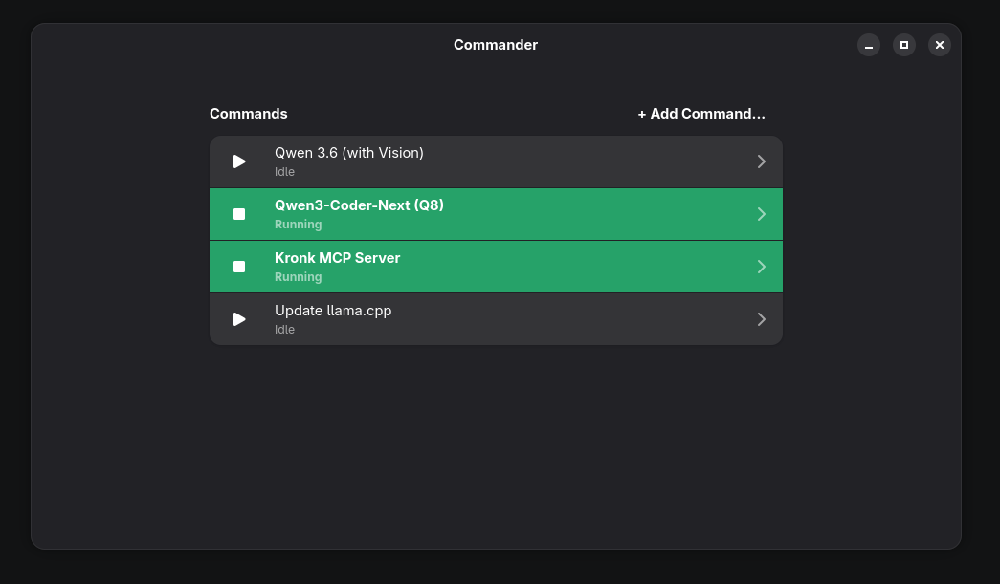
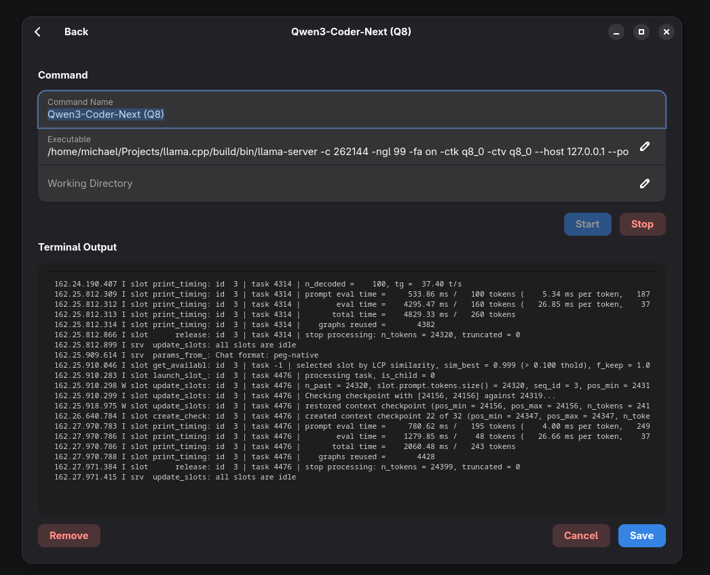

# Commander

A modern, elegant .NET 10 GNOME application for managing and monitoring long-running command-line processes. Commander provides a streamlined interface for launching, controlling, and observing terminal output from executable commands with their arguments.





## Architecture

Commander is built as a dual-project solution to address technical constraints:

- **Commander.Gnome**: The primary GNOME application built with Gir.Core (GTK4/Adwaita), providing the UI and process orchestration.
- **Commander.ProcessWrapper**: A lightweight native wrapper process that ensures clean signal propagation (SIGTERM/SIGKILL) to child processes, enabling graceful shutdown without leaving orphaned subprocesses.

## Features

- **Command Management**: Easily add, configure, and remove commands with custom names, executable paths, and optional working directories.
- **Multi-Executable Support**: Each command can contain multiple executables, each with its own entry. Executables run sequentially, one after another, and execution stops immediately if any executable fails (non-zero exit code).
- **Argument Support**: Commands are split on whitespace to support executables with arguments.
- **Process Control**: Start and stop individual processes with isolated controls.
- **Live Terminal Output**: Monitor real-time stdout/stderr for each command with automatic truncation to the last 500 lines and auto-scroll support.
- **Adwaita UI**: Native GNOME styling with heavy rounded corners, generous padding, and consistent theming.
- **Graceful Termination**: Uses `prctl(PR_SET_PDEATHSIG, SIGTERM)` in the wrapper to ensure child processes receive termination signals when the parent exits.
- **Cross-Platform**: Built on .NET 10 with Gir.Core for GTK4 integration, compatible with Fedora and other Linux distributions.
- **Persistence**: Commands are automatically saved to `~/.local/share/commander/commands.json`.
- **Reliable Asset Loading**: CSS files and native wrappers are loaded from `AppContext.BaseDirectory` to work correctly when launched from desktop menu or pinned app.

## Technology Stack

- **.NET 10**: Latest C# features with top-level statements, implicit usings, and nullable reference types.
- **Gir.Core**: Idiomatic .NET bindings for GTK4 and Adwaita (`GirCore.Adw-1`).
- **Adwaita CSS**: Custom styling for terminal output with a dark monospace theme and rounded corners (loaded from `AppContext.BaseDirectory` at runtime)
- **Native Interop**: P/Invoke to `libc.so.6` for:
  - `prctl()` in the wrapper to set process death signals
  - `execvp()` in the wrapper to replace itself with the target executable
  - `kill()` in the main app to send SIGTERM for graceful termination
- **Async Process Management**: Non-blocking command execution with robust event-driven output handling
- **Desktop Integration**: MSBuild targets for automatic desktop file installation and icon deployment

## Application Identity

- **GApplication ID**: `com.lamothe.Commander`
- **Desktop File ID**: `com.lamothe.Commander.desktop`
- **Desktop Integration**: Desktop files are automatically installed to `~/.local/share/applications` during build. The application is launched from the compiled binary at `bin/Debug/net10.0/Commander.Gnome` (absolute path required for reliable asset loading).

## Installation & Desktop Integration

### Automatic Desktop Integration

The build process includes an MSBuild target (`InstallDesktopIntegration`) that:

1. Copies `com.lamothe.Commander.desktop` to `~/.local/share/applications`
2. Copies `com.lamothe.Commander.svg` icon to `~/.local/share/icons/hicolor/scalable/apps`
3. Runs `update-desktop-database` to refresh the application menu cache

After building, the application will appear in your GNOME Applications menu.

### Desktop File Execution

The desktop file uses an absolute path to the compiled binary:

```ini
Exec=/home/michael/Projects/Commander/Commander.Gnome/bin/Debug/net10.0/Commander.Gnome
```

This absolute path is critical because:

- When launched from the desktop menu, the working directory is undefined
- CSS files and other assets must be loaded from `AppContext.BaseDirectory`, not relative paths
- This ensures the application can locate `Commander.css` and `Commander.ProcessWrapper` reliably

### Manual Desktop Integration

If you need to reinstall the desktop integration:

```bash
cp Commander.Gnome/com.lamothe.Commander.desktop ~/.local/share/applications/
cp Commander.Gnome/com.lamothe.Commander.svg ~/.local/share/icons/hicolor/scalable/apps/
update-desktop-database ~/.local/share/applications
```

## Prerequisites

## Prerequisites

- .NET 10 SDK (preview channel required due to `<LangVersion>preview</LangVersion>`)
- GNOME libraries: `libadwaita`, `gtk4`, `glib`
- Fedora: `sudo dnf install libadwaita-devel gtk4-devel`

## Getting Started

1. **Clone the repository**:

   ```bash
   git clone <repository-url>
   cd Commander
   ```

2. **Restore dependencies**:

   ```bash
   dotnet restore
   ```

3. **Build the application** (includes automatic desktop integration):

   ```bash
   dotnet build
   ```

4. **Launch from Applications Menu**: The app should now appear in your GNOME Applications menu. Click to pin to the dock.

   **Or run directly**:

   ```bash
   dotnet run --project Commander.Gnome
   ```

## Usage

1. Click **"+ Add Command"** to open the configuration dialog.
2. Enter a descriptive **Command Name**, and optionally a **Working Directory**.
3. Add one or more **Executables** using the "+ Add Executable" button. Each executable runs sequentially. Click the trash icon next to an executable to remove it.
4. Click **"Save"** to create the command card.
5. Click the **play button** (or **Start**) to launch the process and **stop** (or **Stop**) to terminate it.
6. Observe real-time terminal output in the dedicated section below each command card.
7. Click a command row in the list to open the detail page where you can edit the command configuration.

### Working Directory Handling

When a working directory is specified and the executable path is relative (not starting with `/`), the application attempts to resolve the executable relative to that directory. If the resolved file exists, it's upgraded to an absolute path for execution.

### Process Lifecycle Management

- **Start**:
  - If the command has multiple executables, they run sequentially. Execution stops immediately if any executable exits with a non-zero exit code (fail-fast behavior).
  - For each executable, the app launches `Commander.ProcessWrapper` (a native wrapper) using an absolute path from `AppContext.BaseDirectory`
  - The wrapper calls `prctl(PR_SET_PDEATHSIG, SIGTERM)` to ensure child processes receive SIGTERM when the wrapper exits
  - The wrapper then calls `execvp()` to replace itself with the target executable
  - Arguments are passed individually via `ArgumentList` to preserve spaces and special characters
  - This ensures process isolation and prevents shell injection issues

- **Stop**:
  - Sends `SIGTERM` (signal 15) via P/Invoke to `kill()` to request graceful termination
  - If the process doesn't terminate within a reasonable time, `process.Kill()` (SIGKILL) is used as a fallback

- **Persistence**: Commands are saved to and loaded from `~/.local/share/commander/commands.json` (JSON format)

### Output Truncation

Terminal output is automatically truncated to the last 500 lines to prevent unbounded memory growth.

## Project Structure

```
Commander/
├── Commander.Gnome/                # Main GNOME Application
│   ├── Application.cs              # UI logic, process orchestration, JSON persistence, and data models
│   ├── Commander.Gnome.csproj      # Project file with Gir.Core dependency and desktop integration
│   ├── Commander.css               # Adwaita-based styling overrides (loaded from AppContext.BaseDirectory)
│   ├── com.lamothe.Commander.desktop
│   ├── com.lamothe.Commander.svg   # Application icon (256x256 SVG)
│   └── README.md                   # Module-level documentation
│
├── Commander.ProcessWrapper/       # Native Process Wrapper
│   ├── Program.cs                  # prctl/execvp implementation for clean signal propagation
│   └── Commander.ProcessWrapper.csproj
│
├── .vscode/                        # VS Code debugging configuration
│   ├── launch.json
│   └── tasks.json
│
├── .gitignore
└── README.md                       # This file
```

## Data Models

- **`CommandInfo`**: Runtime representation of a command configuration, including:
  - Name, Executables (list of executable strings), WorkingDirectory
  - Active `Process` instance
  - Output `TextBuffer` and terminal scroll state
  - `StatusChanged` callback for UI updates
  - `IsAutoScrolling` flag for terminal output behavior

- **`CommandData`**: Serializable DTO used for JSON persistence with required fields for `Name` and `Executable`

## Design Philosophy

Commander prioritizes elegance and correctness:

- **Absolute Paths for Assets**: CSS files are loaded from `AppContext.BaseDirectory` to ensure reliable asset loading when launched from desktop menu
- **No Magic Strings**: All configurations are strongly typed with compile-time safety
- **Strict Type Safety**: Leverages C#'s nullable reference types and modern pattern matching
- **Modern Paradigms**: Uses lambda expressions, top-level statements, and collection expressions
- **Adwaita Compliance**: Follows GNOME HIG with proper spacing, corners, and color variables
- **Robust Process Management**: The wrapper pattern ensures signals reach the target process directly, avoiding shell-related issues and zombie processes
- **Automatic Desktop Integration**: MSBuild targets handle desktop file installation and icon deployment

## License

This project is licensed under the MIT License. A `LICENSE` file should be added to the repository root to comply with this designation.

## Author

Developed with passion for clean code, beautiful UIs, and robust process lifecycle management.

## Notes for Developers

### CSS Asset Loading

When building and launching the application, the `Commander.css` file must be loaded from the application's base directory, not the current working directory. This is critical for desktop menu launches where the working directory is undefined.

**Fix**: All asset loading (CSS, native wrappers) uses `AppContext.BaseDirectory`:

```csharp
var cssPath = Path.Combine(AppContext.BaseDirectory, "Commander.css");
cssProvider.LoadFromString(await File.ReadAllTextAsync(cssPath));
```

This ensures the application works correctly whether launched from:

- GNOME Applications menu
- Pinned dock icon
- Terminal (`dotnet run` or direct binary execution)

### Desktop Integration

The application uses a desktop file with an absolute path to the compiled binary. This is required because:

1. Desktop menu launches don't set a predictable working directory
2. Assets must be loaded from the executable's directory, not relative paths
3. The app must find both `Commander.css` and `Commander.ProcessWrapper` reliably

After building, run `update-desktop-database ~/.local/share/applications` to refresh the application menu cache. The app should appear in your GNOME Applications menu and launch correctly from there.
